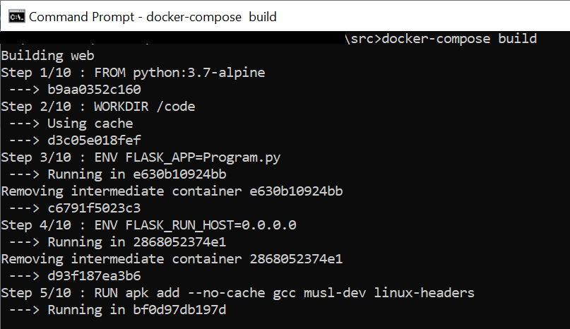
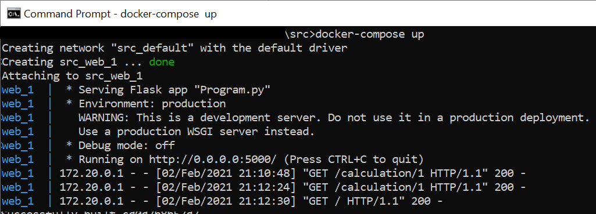
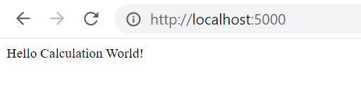
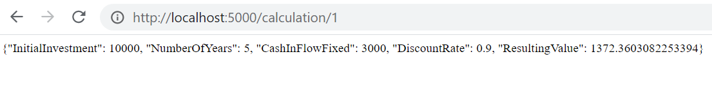

# CalculationRestfulService

## Exposes Calculations in Python, using Flask as RESTful service - Docker Image

### The Financial Calculations included here are:  
1. NPV Calculation  
2. IRR Calculation  

In order to get started with the project:  

1. Pull or Clone from GitHub

2. Build Docker image using docker-compose 

2.1 : Go to src folder in command line

2.2 : Run docker-compose build as in figure:  

3. Up the docker image  

3.1 : From same folder Run docker-compose up as in figure:  

4. Check the working of the service from container  

4.1 Try the welcome route by going to http://localhost:5000/ in browser:  

4.2 Check the calculation route by going to http://localhost:5000/calculation/1 in browser:  

